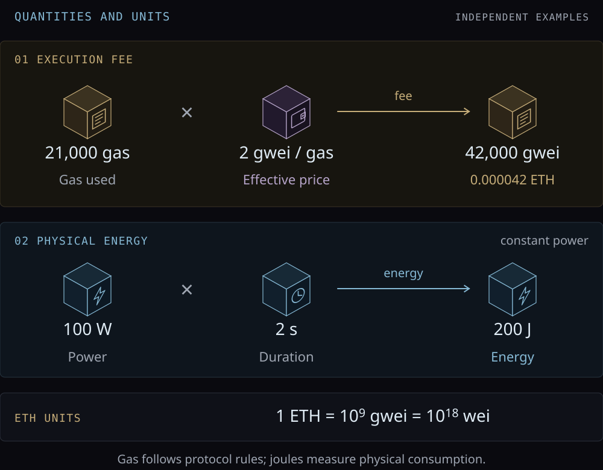
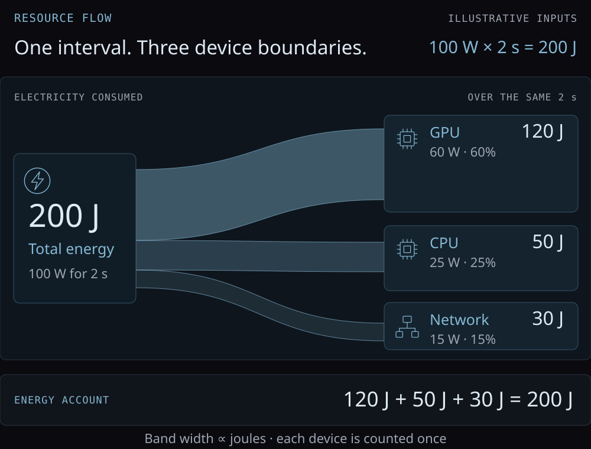

In this section, we introduce the quantities used in our models of agent
economies, together with their units and basic operations.

| Quantity | Symbol | Unit | Type |
| --- | --- | --- | --- |
| Account sequence number | $n$ | none | `Nonce` |
| Asset amount | $v$ | asset base unit | `Amount asset` |
| Execution usage | $g$ | gas | `Gas` |
| Execution price | $p$ | asset base units / gas | `PricePerGas asset` |
| Power | $P$ | W | `Power` |
| Duration | $\Delta t$ | s | `Duration` |
| Energy | $E$ | J | `Energy` |




Gas accounting follows [Ethereum's gas documentation](https://ethereum.org/developers/docs/gas/#what-is-gas),
whose diagram credits [Ethereum EVM illustrated](https://takenobu-hs.github.io/downloads/ethereum_evm_illustrated.pdf).
The energy row is a separate physical calculation. The two numerical examples
are independent; 21,000 gas does not imply an energy use of 200 J.

## Nonce

\begin{definition}[Account nonce]

An account nonce is a nonnegative integer $n$ identifying the next outgoing
transaction in the transfer model. Its successor is

$$
\operatorname{next}(n)=n+1.
$$

\end{definition}

```lean4 file="./Model.lean" declaration="Nonce"
```

```lean4 file="./Execution.lean" declaration="Nonce.next"
```

The [account and transfer](../../Reference/Ethereum/Note.mdx#ethereums-shared-state) both use
`Nonce`. A transfer carrying 7 is accepted only when the account expects 7;
afterwards it expects 8. This counter is different from the nonce miners vary
in a Bitcoin block header.
[Ethereum account nonces](https://ethereum.org/developers/docs/accounts/#an-account-examined),
[Bitcoin block headers](https://developer.bitcoin.org/reference/block_chain.html#block-headers).

## Asset amounts

\begin{definition}[Asset amount]

For a fixed asset $\alpha$, an amount is an integer count $v\in\mathbb{N}$ of
its smallest units. Amounts of different assets have different types.
For native ETH, the smallest unit is wei:

$$
1\ \mathrm{ETH}=10^{18}\ \mathrm{wei}.
$$

\end{definition}

```lean4 file="./../Asset.lean" declaration="Amount"
```

```lean4 file="./../../Reference/Ethereum/Model.lean" declaration="Wei"
```

The `asset` parameter fixes the network and asset identity; decimal metadata
controls display. A value of 3,000,000,000,000,000 wei displays as 0.003 ETH.
[ETH denominations](https://ethereum.org/developers/docs/intro-to-ether/).

## Gas and fees

[Gas](https://ethereum.org/developers/docs/gas/) measures execution usage under
the protocol's rules. It is separate from measured electricity consumption.

\begin{definition}[Execution fee]

Given chargeable gas usage $g$ and an effective price $p$ in base units of asset
$\alpha$ per gas, the fee is

$$
F_\alpha(g,p)=g\,p.
$$

The units satisfy

$$
\begin{aligned}
\mathrm{gas}\times
\frac{\text{asset base units}}{\mathrm{gas}}\\
=\text{asset base units}.
\end{aligned}
$$

\end{definition}

```lean4 file="./Model.lean" declaration="Gas"
```

```lean4 file="./Model.lean" declaration="PricePerGas"
```

```lean4 file="./Execution.lean" declaration="fee"
```

`fee` takes `Gas` and a rate for one asset, then returns an amount of that same
asset. A `Nonce` or `Energy` value cannot be used as its gas argument. All
stored counts are unbounded natural numbers; protocol integer limits are not
encoded here.

For Ethereum, instantiate the asset with native ETH. Using an illustrative
**effective** price of 2 gwei per gas and a supplied usage of 21,000 gas:

```lean4 file="./../../Reference/Ethereum/Checks.lean" declaration="transferGas"
```

```lean4 file="./../../Reference/Ethereum/Checks.lean" declaration="effectivePrice"
```

The fee is 42,000,000,000,000 wei, or **0.000042 ETH**. Gas usage and effective
price are inputs here; this function does not execute the EVM or determine the
price from fee caps. The effective-price rules are specified in
[EIP-1559](https://eips.ethereum.org/EIPS/eip-1559#specification).

At a fixed price, usage can be combined before pricing:

$$
\begin{gathered}
F_\alpha(g_1+g_2,p)\\
=F_\alpha(g_1,p)+F_\alpha(g_2,p).
\end{gathered}
$$

```lean4 file="./Verification.lean" declaration="fee_add"
```

This equality justifies aggregating usage at the same rate. It makes no such
claim for quantities charged at different rates.

## Physical energy

Energy is a resource consumed by the hardware running an agent, storing data,
and communicating with other agents. Computation processes information into
answers, plans, or actions. A service's costs depend on the resources it uses;
its value to the buyer depends on the result and the task.

\begin{definition}[Energy at constant power]

Over an interval of duration $\Delta t$ with constant power $P$,

$$
\begin{gathered}
E=P\,\Delta t,\\
\mathrm{W}\cdot\mathrm{s}=\mathrm{J}.
\end{gathered}
$$

The executable calculation uses whole watts and whole seconds. For varying
power, the continuous relation is $E=\int P(t)\,dt$; it is not implemented by
this constant-power function.

\end{definition}

```lean4 file="./Model.lean" declaration="Power"
```

```lean4 file="./Model.lean" declaration="Duration"
```

```lean4 file="./Model.lean" declaration="Energy"
```

```lean4 file="./Execution.lean" declaration="energy"
```

[NIST's definition of the watt](https://www.nist.gov/glossary-term/34606)
gives the unit relation. At 100 W for 2 s, the energy consumed is 200 J. The power
input must specify what it covers: one device, a server, or a share of a larger
system. Attributing energy to a task also requires a measurement interval and
a rule for allocating shared consumption.

For an illustrative allocation of the same 200 J, suppose a GPU uses 60 W,
a CPU 25 W, and a separate network device 15 W throughout those two seconds.
The bands show each device's share of the energy. These are example inputs,
not hardware measurements; each device is counted once.



```lean4 file="./Checks.lean" declaration="deviceEnergy"
```

The three calculations return 120, 50, and 30 J. Their sum equals the 200 J
computed from the combined power of 100 W over the same interval.

Energy enters an agent's economic account through an electricity tariff; service
revenue comes from the buyer's payment. Comparing them requires a common currency
or asset and an explicit exchange rate when needed. Hardware costs and payments
to other services are additional expenses. If a provider pays a hosted API price,
its energy costs may already be included in that bill and must not be counted
again as a separate expense.

An energy budget also constrains which tasks an agent can perform. Comparing
implementations means holding the task and its quality requirements fixed, then
comparing energy, completion time, and monetary cost. The amount of useful
information in a result is not determined by the joules consumed. These
relationships need a specified task and hardware; neither a gas-to-joule
conversion nor an energy-to-value conversion is assumed here.
