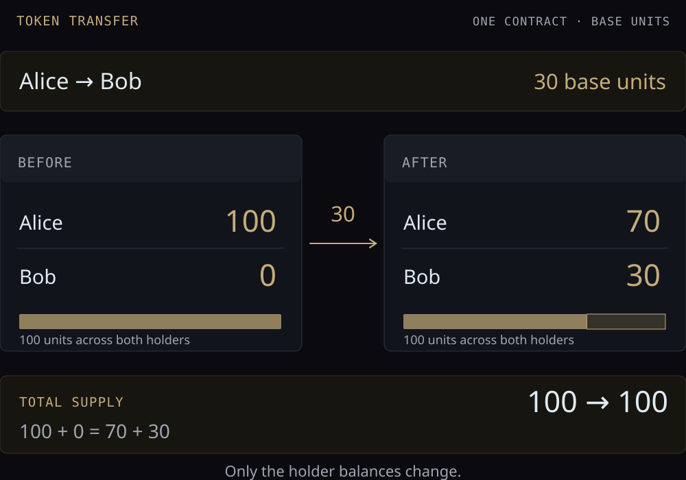

Alice holds 100 base units of a token and transfers 30 to Bob. The token contract
records 70 for Alice and 30 for Bob. These numbers belong to that token's ledger;
they are not the ETH balances of Alice and Bob.



## In OpenZeppelin Contracts

[OpenZeppelin Contracts](https://github.com/OpenZeppelin/openzeppelin-contracts)
provides Solidity implementations of common contract standards. Its
[`ERC20.sol` at cd3284f](https://github.com/OpenZeppelin/openzeppelin-contracts/blob/cd3284fde41f1c56d19078f580a0aed751cf11d2/contracts/token/ERC20/ERC20.sol)
stores balances in `_balances` and reads them through `balanceOf`.

`transfer` obtains the sender from `_msgSender()`, then calls `_transfer`.
`_transfer` rejects zero addresses and delegates the balance changes to `_update`.
For an ordinary transfer, `_update` checks the sender's balance, debits it, then
credits the recipient and emits a `Transfer` event. Minting and burning take
other branches.

`decimals()` defaults to 18 in this implementation. It affects display only:
30 base units with 18 decimals display as $30 / 10^{18}$ tokens. Other contracts
can override the value. The [ERC-20 standard](https://eips.ethereum.org/EIPS/eip-20)
also defines `approve`, `allowance`, and `transferFrom` for delegated spending.

## Token balances and transfers

A token is identified by its network and contract address. Decimal metadata
does not change that identity.

```lean4 file="./Model.lean" declaration="Token"
```

The ledger belongs to one token contract. A holder address selects a balance
inside that ledger:

```lean4 file="./Model.lean" declaration="State"
```

`Amount token.asset` keeps the transfer quantity tied to the token. The selected
ordinary-transfer model checks addresses and available funds before subtraction:

```lean4 file="./Execution.lean" declaration="transfer"
```

A self-transfer returns the original state. In the Solidity implementation,
the debit and subsequent credit reach the same result. `totalSupply` stays
unchanged during an ordinary transfer.

```lean4 file="./Checks.lean" declaration="transferReport"
```

The example returns `some (70, 30, 100)`: Alice's balance, Bob's balance, and total
supply. The build also checks insufficient funds, zero addresses, zero amount,
and self-transfer. The example contract address is a local fixture.

This model uses unbounded `Nat` balances and assumes valid, normalized address
strings. It selects balance updates from the contract; it does not implement
`uint256` bounds, event logs, allowances, minting, or burning. ETH gas accounting
is separate from this token ledger.
