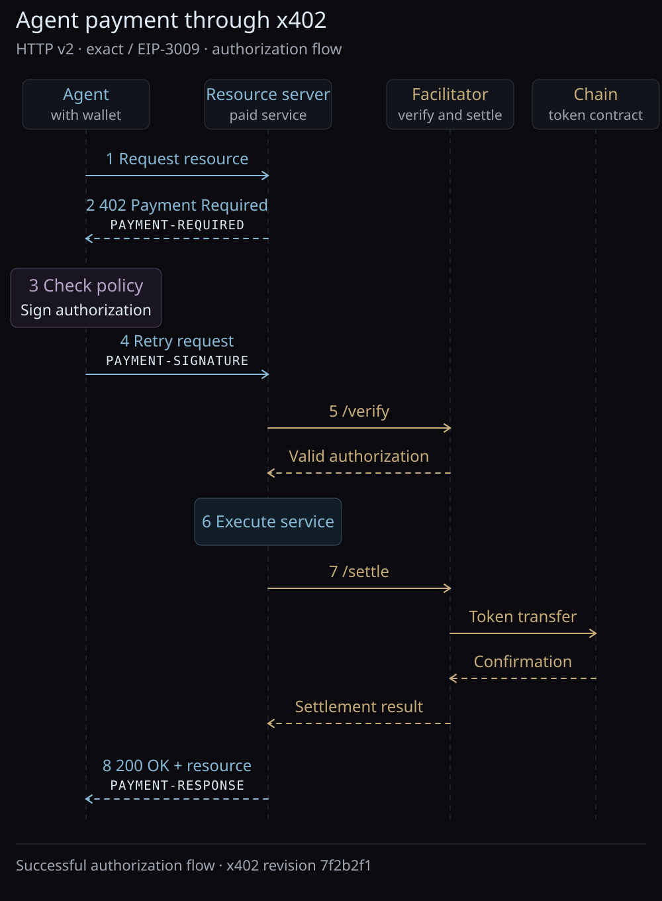

In this section, we review payment protocols and infrastructure for agents:
x402 for payment exchange, AP2 for authorization, Circle Gateway for settlement,
and Nevermined for metering and billing. We then present a Lean model of x402
payment requirements and a program for decoding amounts in integer base units.

Our main references are the official
[x402 specification](https://github.com/x402-foundation/x402/blob/7f2b2f1f77fa5317615735e3378a6fad41cccb4e/specs/x402-specification-v2.md),
[AP2 specification](https://github.com/google-agentic-commerce/AP2/blob/e1ea56db72a6385bce3e5c1112b3a56ce60acb43/docs/ap2/specification.md),
[Circle Gateway documentation](https://developers.circle.com/gateway-nanopayments),
and [Nevermined documentation](https://nevermined.ai/docs/getting-started/core-concepts).
We use x402 v2 at `7f2b2f1` and AP2 v0.2 at `e1ea56d`; the product documentation
was consulted on 9 October 2026.

<span id="payment-exchange"></span>

## Payment exchange with x402

Consider an agent requesting a paid API resource. The service returns HTTP
`402 Payment Required` with structured payment terms. The agent's client can
read the price, asset, network, and recipient, obtain a payment authorization
from its wallet, and retry the request with that authorization. This extends
an ordinary HTTP request with a payment exchange that software can carry out.
The [x402 client and server documentation](https://docs.x402.org/core-concepts/client-server)
describes these two roles.

The diagram follows the successful `authorization` flow for the `exact` EVM
scheme using EIP-3009. The server uses a facilitator to verify and settle the
payment; it can also perform these operations itself. The wallet's policy check
is a client-side decision before signing.



In this flow, verification precedes service execution, and settlement follows
it. Verification checks the authorization without moving funds. Settlement
submits the transfer; the successful response follows confirmation. These are
the ordering rules of the
[`authorization` flow](https://github.com/x402-foundation/x402/blob/7f2b2f1f77fa5317615735e3378a6fad41cccb4e/specs/x402-specification-v2.md)
at the pinned revision. Other flow models have different ordering rules.

For EIP-3009, the client signs transfer parameters including the recipient,
amount, validity period, and nonce. The facilitator submits the authorized
transfer to the token contract and pays the transaction gas. Verification can
succeed while a later settlement fails, for example if the available balance
changes. The
[`exact` EVM scheme](https://github.com/x402-foundation/x402/blob/7f2b2f1f77fa5317615735e3378a6fad41cccb4e/specs/schemes/exact/scheme_exact_evm.md)
specifies the checks and settlement operation.

<span id="agent-payments-and-shared-rules"></span>

### Shared messages and rules

For this EVM flow, the agent needs a funded wallet, permission to spend, and a
client that supports the offered payment scheme and network. Its client can
handle the exchange during an API call: read the terms, choose an acceptable
option, obtain authorization, and retry. The
[wallet's authorization policy](../../Native/Wallet/Note.mdx) determines whether the agent
may pay that amount to that recipient. x402 gives the client a common way to
receive the terms and submit payment data. This is what makes the payment step
amenable to automation, as described in the
[HTTP 402 documentation](https://docs.x402.org/core-concepts/http-402).

x402 is a protocol because it specifies messages with agreed meanings and
rules for processing them. In the HTTP transport, the three payment messages
are Base64-encoded JSON carried in headers:

<div className="notebook-comparison">

| Direction | Header | Contents |
| --- | --- | --- |
| Server → client, with HTTP 402 | `PAYMENT-REQUIRED` | `PaymentRequired`: the resource and acceptable payment options |
| Client → server, on retry | `PAYMENT-SIGNATURE` | `PaymentPayload`: the selected option and payment data |
| Server → client, after settlement | `PAYMENT-RESPONSE` | Settlement result, including success or failure and transaction information |

</div>

The [HTTP transport specification](https://github.com/x402-foundation/x402/blob/7f2b2f1f77fa5317615735e3378a6fad41cccb4e/specs/transports-v2/http.md)
also defines failure responses. Invalid payment data does not produce a
successful resource response; the server can return HTTP 402 with payment
requirements and an error. A settlement failure can be reported in
`PAYMENT-RESPONSE`.

These common rules let independently written clients and servers interpret the
same exchange when they support compatible versions, schemes, and networks.
In the EVM case, HTTP carries the messages; the payment scheme defines
authorization and validation; the blockchain executes the transfer. The resulting payment record
establishes a transfer of funds. Whether the service result satisfies the
agent's task is a separate application decision.

## Payment authorization with AP2

AP2 specifies evidence that a user has authorized an agent to purchase a
particular checkout and pay for it. In the
[v0.2 specification](https://github.com/google-agentic-commerce/AP2/blob/e1ea56db72a6385bce3e5c1112b3a56ce60acb43/docs/ap2/specification.md),
a Checkout Mandate authorizes the purchase and a Payment Mandate authorizes its
payment. Both bind to the merchant's signed checkout through its hash.

For example, a user permits an agent to buy a report for at most USD 1.00. The
agent later finds an eligible report costing USD 0.60. In AP2's autonomous flow,
the user approves constraints through a Trusted Surface. The resulting *open*
mandates identify the agent's public key and authorize actions within those
constraints. The agent signs *closed* mandates for the specific checkout and
presents them with the open mandates. In the human-present flow, the user
approves the specific checkout and payment directly. The
[Agent Authorization framework](https://github.com/google-agentic-commerce/AP2/blob/e1ea56db72a6385bce3e5c1112b3a56ce60acb43/docs/ap2/agent_authorization.md)
describes how approval becomes verifiable evidence.


The merchant checks the Checkout Mandate against its checkout and the approved
constraints. The credential provider verifies payment authorization before
issuing a payment credential; the payment processor checks that the credential
is scoped to this checkout. Signed checkout and payment receipts record their
respective outcomes. These checks run in deterministic code. The
[AP2 flows](https://github.com/google-agentic-commerce/AP2/blob/e1ea56db72a6385bce3e5c1112b3a56ce60acb43/docs/ap2/flows.md)
describe the messages between these roles.

Our [wallet policy](../../Native/Wallet/Note.mdx#spending-policy) checks an actor, recipient,
asset, and amount locally. AP2 adds evidence that other parties can verify.
The payment method still determines how funds move. An AP2 deployment can use
card payments or an x402 integration; AP2 and x402 have distinct responsibilities.

## Batched settlement with Circle Gateway

Circle Gateway maintains a USDC balance usable across its supported networks.
Its [Nanopayments service](https://developers.circle.com/gateway-nanopayments)
accepts signed payment authorizations and batches their settlement. A buyer
first deposits USDC into a Gateway Wallet contract, then signs authorizations
offchain for subsequent payments.

Consider three API calls priced at 0.003, 0.004, and 0.003 USDC, paid from an
initial Gateway balance of 1 USDC. When Gateway accepts the authorizations, it
locks the buyer's funds and records the seller's pending balance. The service
can respond before the batch is confirmed onchain. After confirmation, the
seller's funds become available. This follows Circle's
[batching lifecycle](https://developers.circle.com/gateway-nanopayments/concepts/batched-settlement);
the amounts below are illustrative and exclude fees.


Batching spreads the cost of an onchain transaction across many payments. The
gas-free payment step uses an existing Gateway deposit; depositing funds and
the later batch commitment still involve onchain transactions. Circle's
documented design relies on an AWS Nitro Enclave to validate authorizations and
sign batch results, and on contracts to check those signatures.

This changes the timing shown in the earlier `exact` EVM example: a successful
service response can precede batch confirmation. Gateway acceptance, pending
funds, and available funds are separate states. The backend and payment scheme
determine this settlement behavior; HTTP 402 alone does not determine when funds
become available.

## Metering and billing with Nevermined

Nevermined supplies SDKs and payment services for APIs, agents, and tools. A
seller registers a service and attaches a *payment plan* specifying its price,
payment method, and access terms. The platform checks access, meters usage, and
processes charges. Its
[core concepts](https://nevermined.ai/docs/getting-started/core-concepts)
distinguish prepaid plans from pay-as-you-go plans.

For an illustrative prepaid plan, USD 1.00 buys 100 credits and one API call
consumes three credits. After that call, 97 credits remain. These credits measure
usage within the plan. A pay-as-you-go plan instead charges the configured
payment method per request, for example USD 0.03 for the same call.


In Nevermined's
[x402 integration](https://nevermined-io.github.io/payments-py/dev/api/11-x402/),
the seller verifies payment permissions before executing the request and settles
after successful processing. Nevermined acts as the facilitator and supplies
its own schemes, including `nvm:erc4337` for crypto payments and
`nvm:card-delegation` for delegated card payments. Their authorization and
settlement rules differ from the `exact` EIP-3009 example above.

The SDK distinguishes a credit redemption from a pay-as-you-go charge in the
settlement response. A successful pay-as-you-go payment can report zero credits
redeemed because no prepaid credits were consumed. The billing model determines
how to interpret the receipt. USDC is one supported payment asset; credit
amounts belong to the service's plan and have their own units.

## Payment requirements

Our Lean projection retains the core fields of `PaymentRequirements` from the
SDK's
[`payments.ts`](https://github.com/x402-foundation/x402/blob/7f2b2f1f77fa5317615735e3378a6fad41cccb4e/typescript/packages/core/src/types/payments.ts).
`NetworkId` separates the namespace and chain reference; the source encodes them
together, such as `eip155:84532`.

```lean4 file="./Model.lean" declaration="PaymentRequirements"
```

The surrounding response can offer several options for the same resource:

```lean4 file="./Model.lean" declaration="PaymentRequired"
```

The example uses the upstream EIP-3009 payment terms for 0.01 USDC on Base
Sepolia (`eip155:84532`), encoded as `"10000"` base units. This is testnet USDC
with no dollar redemption value. The
[stablecoin discussion](../ERC20/Note.mdx#stablecoin-payments) explains pricing
and units.

```lean4 file="./Checks.lean" declaration="exampleRequirements"
```

`amountUnits exampleRequirements` returns `some 10000`; `"0.01"`, `"-1"`, and
`"invalid"` are rejected by the integer decoder. Turning base units into a display
amount requires the token's decimal metadata, as in the
[assets and tokens note](../ERC20/Note.mdx).

Our executable model stops at x402 requirements and integer amount decoding.
It omits `extra`, signature verification, and settlement execution. The AP2,
Gateway, and Nevermined sections are studies of their published designs; this
repository does not implement their authorization, batching, or billing systems.
`maxTimeoutSeconds` describes a duration; it is not itself an absolute expiry
timestamp or a transaction nonce.

The [lost-reply example](../../Cases/PaidCall/Note.mdx#recover-a-lost-reply) studies
application retries separately: a local atomic payment and saved receipt allow
the client to recover a result without paying twice. Its proof does not cover
the gap between an external chain transaction and saving that receipt.

The [A2A x402 extension](https://github.com/google-agentic-commerce/a2a-x402)
connects payment messages with [agent interaction](../A2A/Note.mdx). A2A task completion and x402
payment settlement remain separate events.
