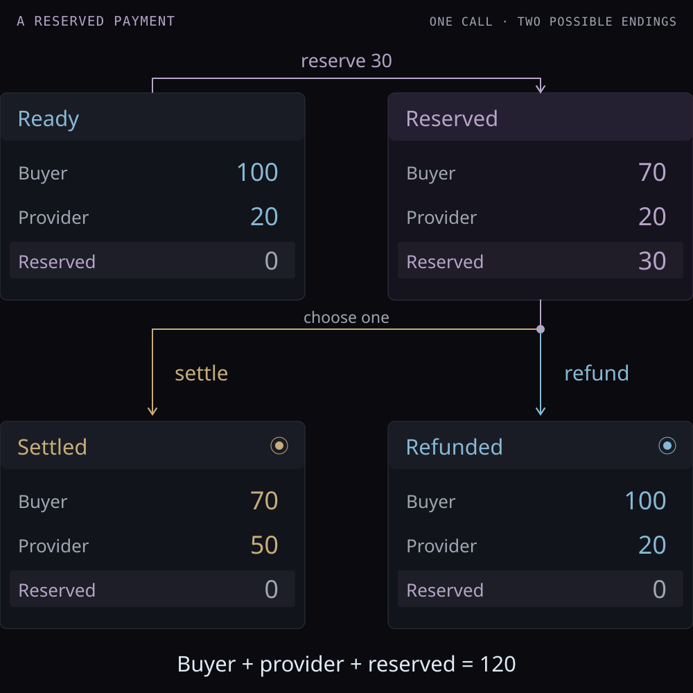

In this section, we model reservation, settlement, and refund for a single
payment. We implement the state transitions in Lean and prove that every
accepted action and sequence preserves total funds. We then extend the model
with a saved receipt and prove that retries after a lost reply do not repeat
the payment.

## Follow the money

A buyer requests a service from a provider for 30 units. Initially, the buyer
has 100 units and the provider has 20. Reserving 30 units sets them aside for
this call, so neither party can spend them while payment is pending.



Settlement transfers the reservation to the provider. Refund returns it to the
buyer. These are alternative endings to the same reservation.

The total stays at 120, but the available balances alone fall to 90 while the
call is pending. We therefore need to count reserved funds separately. Here a
reservation is an entry in our model; no real wallet or custody service is involved.
Amounts are natural numbers in one common unit, and we assume no fees.

## Represent the state

The four phases record where we are in the call. The `reserved` phase also holds
the price: the amount to transfer on settlement or return on refund:

```lean4 file="./Model.lean" declaration="Phase"
```

A state combines this phase with the two available balances:

```lean4 file="./Model.lean" declaration="State"
```

Keeping the price inside `reserved` means a settled or refunded state cannot
retain a reservation. The representation expresses this choice directly.
The function `escrow` reads the reserved amount, returning zero in every other phase:

```lean4 file="./Model.lean" declaration="escrow"
```

The sum of the three balances is:

```lean4 file="./Model.lean" declaration="totalFunds"
```

## State the rule, then implement it

Our specification says that a successful transition must leave this total
unchanged. It compares two states without saying how to compute the second:

```lean4 file="./Spec.lean" declaration="PreservesFunds"
```

The implementation supplies that computation. There are three actions:
`reserve price`, `settle`, and `refund`. Reservation is allowed only when the
call is ready and the buyer can afford the price. Settlement and refund each
require a reservation. Everything else is rejected.

<CodePreview title="Execute one action">

```lean4 file="./Execution.lean" declaration="execute"
```

</CodePreview>

Read each successful branch against the diagram. Reservation subtracts from the
buyer, settlement adds to the provider, and refund adds back to the buyer.
`some next` returns the resulting state; `none` rejects the action without
returning a new state. After either ending, the final catch-all branch also
rejects any attempt to settle the same call again.

The balance check matters: subtraction on `Nat` stops at zero. Reserving 130
from a buyer with 100 without this check would leave buyer 0 and reservation
130, creating 30 units in the accounting.

## Run the paths

`run` feeds each successful state into the next action. An empty action list
returns the current state, and a rejected action makes the whole result `none`:

```lean4 file="./Execution.lean" declaration="run"
```

From the repository root, run:

```sh
lake exe demo
```

The demo starts at balances 100 and 20. Reserving 30 and settling gives 70 and
50; reserving 30 and refunding gives 100 and 20. Trying to settle twice returns
`none`. This is a pure calculation: rejecting a sequence does not undo payments
already made in some external system.

Before trying another example, predict what happens when the buyer reserves
101 units, or reserves zero. Which branch of `execute` explains each result?

## Why the total is preserved

The example checks particular numbers. To cover every accepted action, consider
each of the three successful branches. Write the balances as $b$ and $v$, and
the price as $p$:

- Reservation changes the total from $b+v$ to $(b-p)+v+p$. The check $p\le b$
  ensures subtraction loses exactly $p$, so adding it back restores the total.
- Settlement changes $b+v+p$ to $b+(v+p)$.
- Refund changes $b+v+p$ to $(b+p)+v$.

All three preserve the sum. The theorem states this for any `before`,
`action`, and `after`, provided execution actually returns `some after`:

<CodePreview title="Conservation for one action">

```lean4 file="./Verification.lean" declaration="execute_preservesFunds"
```

</CodePreview>

The proof follows the same case split. Simplification removes rejected cases,
which contradict the `accepted` hypothesis. In the remaining cases, `omega`
discharges the arithmetic equalities using the balance check where needed.

For a successful sequence, apply this argument at every step: the first step
preserves the total, and so does the remaining sequence. This induction is the
proof of `run_preservesFunds` in
[Verification.lean](https://github.com/CloK-Lab/vdsi/blob/main/VDSI/Cases/PaidCall/Verification.lean).
That file also checks rejection after a finished call and restoration of the
initial balances by reserve followed by refund.

## Recover a lost reply

Suppose the buyer pays 30 units, but the reply is lost before reaching the
client. The provider now has 50 units, while the client has no receipt. Rejecting
a second settlement prevents another transfer, but does not tell the client
what happened to the first one.

We give the purchase an identifier and save its receipt with the payment. The
client retries the same purchase, and the server sends the saved receipt.
The example uses purchase 7 and a pure echo service: input `"report"` produces
result `"report"`. Amounts remain integer base units of one fixed asset, with
no fees.

<div className="notebook-comparison">

| Event | Buyer | Provider | Payment commits | Client has receipt |
| --- | --- | --- | --- | --- |
| Initial state | 100 | 20 | 0 | No |
| Request committed | 70 | 50 | 1 | No |
| Reply lost | 70 | 50 | 1 | No |
| Same purchase retried | 70 | 50 | 1 | No |
| Reply delivered | 70 | 50 | 1 | Yes |

</div>

This distinguishes a purchase identifier from a transfer nonce.
[EIP-3009](https://eips.ethereum.org/EIPS/eip-3009) prevents reuse of a transfer
authorization through its nonce. If a client creates a fresh authorization for
the same purchase after a timeout, the application must still recognize that
purchase. Our example studies this application-level accounting rule. It does
not execute EIP-3009 or the x402 protocol.

### Bind the receipt to the purchase

The approved call fixes the identifier, price, and service input:

```lean4 file="./Retry/Model.lean" declaration="Call"
```

The buyer, provider, asset, and authenticated client are fixed for the entire
case. Approval is an input to the model. A request must match the complete
approved call; changing its price or input while retaining the identifier is
rejected without a state change. A different purchase identifier is also
rejected by this single-purchase instance.

`saved` holds the committed receipt. `pending` holds a reply in transit, and
`received` records the client's last delivered reply:

```lean4 file="./Retry/Model.lean" declaration="State"
```

Dropping a reply clears `pending`, leaving the payment and `saved` unchanged.
Delivery moves a pending receipt to the client. Delivery with no pending reply
leaves the state unchanged.

The first accepted request uses the existing reservation and settlement
functions. The resulting balances and echo receipt are saved together in one
atomic transition. A retry enqueues the saved receipt without calling the
payment interpreter again:

<CodePreview title="Handle a request or retry">

```lean4 file="./Retry/Execution.lean" declaration="request"
```

</CodePreview>

The `commits` field counts these atomic model payments. In the trace above,
two requests cause one payment commit. This is an operation count for this
model; it does not measure network latency or gas savings.

### Prove the retry behavior

The accounting specification permits two states: the initial balances with no
saved receipt, or exactly one transfer of the approved price with its receipt.
It also requires sufficient initial funds for the latter state:

<CodePreview title="Accounting before and after payment">

```lean4 file="./Retry/Spec.lean" declaration="Accounting"
```

</CodePreview>

`RepliesMatch` requires every pending or delivered receipt to match the saved
receipt. `execute_preservesInvariant` proves these conditions are preserved by
each request, loss, or delivery; induction extends the result to any finite
sequence. In particular, any such sequence commits at most once:

<CodePreview title="At most one payment across arbitrary retries">

```lean4 file="./Retry/Verification.lean" declaration="run_atMostOnce"
```

</CodePreview>

`run_preservesFunds` proves the balances and any reservation still sum to the
initial total. `run_receivedReceipt` proves that a delivered receipt identifies
the approved purchase and a committed model payment. The recovery theorem
states the complete result when the first reply is lost and the retry's reply
is delivered:

<CodePreview title="Recover the result after a lost reply">

```lean4 file="./Retry/Verification.lean" declaration="lostReply_recovers"
```

</CodePreview>

Run `lake exe demo` to see these states. The executable checks also cover
insufficient funds, changed terms, repeated retries, exact funding, and a
zero-price call.

### Atomicity and delivery assumptions

The proofs assume a serialized transition that commits the local balance
changes and saved receipt together. The record is retained for all retries;
deleting it or reusing this instance for a different purchase is outside the
model. The service is a pure echo computation with no external effects.

A chain transaction and a database write do not automatically form such an
atomic transition. A crash after chain settlement but before saving the receipt
requires a recovery mechanism that reconciles the external payment with the
purchase record. The current proof does not cover that failure, cryptographic
verification, multiple purchases sharing a budget, or chain finality.

Reply loss can continue indefinitely. Recovery is proved for a retry whose
reply is delivered; eventual delivery is an environmental condition. A payment
receipt establishes the modeled payment and echo result, without establishing
the quality of an external service.
